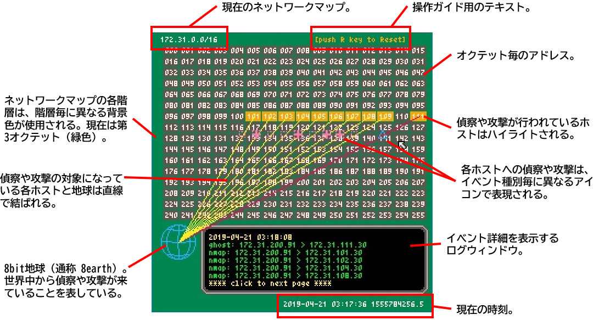

# 8vana: The visualization tool of security incidents like retro games.

   

English page is coming soon!!  

## 概要
我々は”**セキュリティのインシデントをリアルタイムにレトロゲーム風に可視化**”するツール「**8vana**(ハチバーナ)」を開発しました。セキュリティインシデントを可視化するツールは既に幾つも存在しますが、「UIが馴染まない」「ハイスペックな動作環境が必要」「費用が高い」などのハードルが往々にしてあるため、誰でも気軽に扱えるツールは多くはありませんでした。  

そこで、我々の8vanaは”**会いに行けるインシデント可視化ツール**”をコンセプトに、UIとエンジンをレトロゲーム風にすることで「**ユーザフレンドリーなUI**」と「**低スペックでも動作可能**」を実現、そして「**OSSとして公開**」することで、誰でも気軽にお使い頂ける多くの工夫を行いました。我々は、8vanaを世界中の多くの方々に使っていただき、インシデント・レスポンスの裾野を広げ、**世の中のインシデント対処に少しでも多く貢献する**ことを目指しています。  

なお、8vanaはインシデントを可視化できるという特性上、あなたがお使いの**Offensiveツールの挙動や攻撃シミュレーションをも可視化**できます。すなわち、あなたの**ツールデモやCTF、サイバーセキュリティ演習などで8vanaを使う**ことができ、これにより素晴らしいアイキャッチ効果を得ることも可能です。  

   

## システム構成
   

## インストール手順

### Pyxelのインストール
Pyxelをインストールするには、事前にPythonのバージョン3.7以降をインストールしておく必要があります。  

```
$ pip install -U pyxel
```

### 8vanaのインストール
8vanaを本リポジトリからCloneし、任意のディレクトリに展開します。  

```
$ git clone https://github.com/8vana/8vana.git
```

## 使用方法
8vanaには、現在**2つのレンダリングモード**が存在します。  
※最終的には8つのレンダリングモードを実装予定です。  

 * 1vana  
 計算され尽くしたUIを備え、サイバーな雰囲気を感じることができるモード。  

 * 2vana  
 某戦車RPG風のUIを備え、攻撃者と監視対象システムが相対しているような雰囲気を
醸し出すモード。  

以下、各レンダリングモード毎に使用方法を解説します。  

### 1vana
     

#### 1vanaを起動する

```
$ cd 8vana/1vana
$ python3 ./8vana.py
```

#### 1vanaのヘルプ
1vanaのヘルプを確認するには `-h` オプションを付けて実行します。  

```
$ python3 ./1vana.py -h
usage: 1vana.py [-h] [-l]

1vana

optional arguments:
  -h, --help      show this help message and exit
  -l, --log_time  このオプションは、ログ再生機能で利用することを想定されており、ログファイル先頭のリソース（最も古いログ）から時刻を取得
                  し、開始時刻の基準値として利用します。このオプションを利用しない場合は、現在時刻が開始時刻として利用されます。
```

#### 1vanaのコンフィグ
動作設定は `env.py` で制御されています。  
基本的な設定は以下の通りです。詳細は `env.py` を参照してください。  

##### NPUT_LOG
1vanaが参照するログファイルを指定します。デフォルトは `converted_logs/8vana_input.json` です。  

##### LOG_POLLING_TIME
ログのアップデートを確認するタイミングを秒単位で指定します。デフォルトは `5` 秒です。  

##### LOG_HASH_ALGO
ログファイルの変更を検出するためのハッシュアルゴリズム。デフォルは `md5` です。  

##### FRAME_SECOND
何フレームで1vanaの時間を１秒進めるか指定します。デフォルトは `3` フレームです。  
デフォルトの`30fps`の時に`FRAME_SECOND`を`30`に設定すると、実時間と同じスピードで描画されます。つまり、同一条件の時に`3`を設定すると、10倍のスピードで時間が進むことになります。  

##### FRAME_SECOND_REAL
FRAME_SECOND_REAL は、実時間の1秒を検出するための設定です。  
fpsの設定に合わせて指定します。差分があると正しく1秒を検出できなくなるので注意が必要です。  

##### VISUALIZE_TIME_RANGE
デフォルトで1vanaは、現在時刻から前後30秒の情報を表示します。  
表示範囲を変更する場合にこの値を変更する。  

##### VISUALIZE_TIME_WAIT
1vana起動時に描画を開始するまでの待ち時間です。  
ログから再生して描画する際に利用されます。デフォルトは`5`秒ですが、この秒数は `FRAME_SECOND`の影響を受けます。  

##### hostdata
各ホストのモノリスで表示するアイコンや、モノリスを表示した際のアクションを設定します。  
フォーマットは以下の通り。  

```
hostdata = {
    'default': {
        'icon': 'unknown',
        'action': None,
    },
    '172.31.101.30': {
        'icon': 'debian',
        'action': 'zeijyaku',
    },
```

各設定はホスト単位で指定する必要があります。  
設定値の説明は以降に記載します。  

###### icon
iconには定義済みのicon名を指定することができます。  
現在利用できるのは以下の2種類のみ。  

 * unknown  
 * debian  

これらの画像は、64x64pixに最適化されています。  

なお、任意iconの画像は、1vanaのApp関数内でimageloaderを利用して定義することで追加することができます。  

1vanaにimageloaderでアイコン画像を追加する場合は、次のようにApp関数に追加します。  
同一の名前のiconに複数の画像を追加すると、デフォルトでは8フレーム単位で切り替わります。  

```
        self.actor["<任意の名前>"] = actor.Actor()
        self.actor["<任意の名前>"].imageload("<ファイルパス>")
        self.actor["<任意の名前>"].imageload("<ファイルパス>")
```

ただし、Pyxelではindexed colorのpng形式のみサポートされることに注意が必要です。  
24bitのpng画像は、添付のコンバーター「`png_convert.py`」を利用することで簡単に変換できます。  

###### action
actionに `zeijyaku` と設定されている場合、モノリスを開いて10フレーム経過してから20フレーム経過すまでの間に脆弱のアイコンが表示されます。  
現時点では、演出用に利用できるのみの実験的な機能になっている。  


### 2vana
     

#### 2vanaを起動する
```
$ cd 8vana/2vana
$ python3 ./2vana.py
```

#### 2vanaのコンフィグ
2vanaの動作は `2vana/config.ini` で設定できます。  
基本的な設定値を以下に示します。  

##### 攻撃元ホスト（War Tank）の設定
監視対象ホストに偵察行為や攻撃行為を行う攻撃元ホストを指定します。  
IPアドレスまたは任意のホスト名を設定することができます。  

 * War Tankが1ホストの場合（IPアドレス表記）  
 ```
 [Attacker]
 attackers : 192.168.220.129
 ```

 * War Tankが1ホストの場合（ホスト名表記）  
 ```
 [Attacker]
 attackers : GyoiThon
 ```

 * War Tankが4ホストの場合  
 アットマーク区切りで各ホストを記述します。  
 ```
 [Attacker]
 attackers : 192.168.220.129@192.168.220.130@GyoiThon@192.168.220.132
 ```

なお、War Tankの数は**最大で4台**です。  
5台以上のホストを記述した場合、**5台目以降は無視**されますのでご注意ください。  

##### 監視対象ホストの設定
監視対象ホストを指定します。  
IPアドレスまたは任意のホスト名を設定することができます。  

 * 監視対象ホストが1ホストの場合（IPアドレス表記）  
 ```
 [Target]
 targets   : 192.168.184.155
 ```

 * 監視対象ホストが1ホストの場合（ホスト名表記）  
 ```
 [Target]
 targets   : Metasploitable3
 ```

 * 監視対象ホストが3ホストの場合  
 アットマーク区切りで各ホストを記述します。  
 ```
 [Target]
 targets   : 192.168.184.155@192.168.184.129@192.168.184.134
 ```

なお、監視対象ホストの数は**最大で12台**です。  
13台以上のホストを記述した場合、**13台目以降は無視**されますのでご注意ください。  

##### ログ監視関連の設定
2vanaは、Ultimate Log Parserが作成したJSON形式のログファイルからイベントを取り込み描画します。ログの監視時間間隔やログのPathをしたい場合は、以下の設定を変更します。  

```
[LogParser]
watch_period       : 3
converted_log_path : converted_logs
converted_log_file : 8vana_input.json
```

 * `watch_period`  
 ログの監視時間間隔（単位は秒）です。  
 最小設定値は1秒となり、これより小さい値に設定した場合は強制的に1秒に設定されます。  

 * `converted_log_path`  
 監視対象ログのPathです。  
 通常は8vanaのルート直下にある`converted_logs`ディレクトリを使用するため、変更することはないでしょう。  

 * `converted_log_file`  
 監視対象ログのファイル名です。  
 通常はUltimate Log Parserが生成する`8vana_input.json`を参照するため、変更することはないでしょう。  

#### 画像コンバーター「png_convert.py」
24bitのpngファイルをindexed colorのpng画像に変換するスクリプトです。  
Pyxelのデフォルト設定で利用可能な16色のうちから、最も近い色を検出して置換することができます。  

##### 使用方法
png_convert.pyを利用する場合は、以下のように利用します。  
※png_convert.py自体はcommonディレクトリ配下に配置されています。  

```
$ cd common/png_convert
$ python3 png_convert.py <input file> <output file>
```

## パーサーについて

1vanaが読み込むファイルは `env.py` の `INPUT_LOG` で指定します。デフォルトは `converted_logs/8vana_input.json` を読み込みます。

以下は、8vanaが読み込み可能なJSON形式の正規化されたログの例です。

```
[
  {
    "phase": "discover",
    "attack": "nmap",
    "time": 1555784308.0,
    "from": "172.31.200.91",
    "to": "172.31.101.30",
    "note": {
      "option": "",
      "CVE": [
        "N/A"
      ]
    }
  },
  {
    "phase": "discover",
    "attack": "nmap",
    "time": 1555784308.0,
    "from": "172.31.200.91",
    "to": "172.31.101.30",
    "note": {
      "option": "",
      "CVE": [
        "N/A"
      ]
    }
  }
]
```


`phase`, `attack`, `time`, `from`, `to`, `note` は必須項目です。ただし、`note` の使われ方は各モードに依存するため、各モード毎の説明を確認してください。

各必須項目に設定可能な設定値は以下の通り。あなたが、独自ツールを8vanaで可視化する場合は、このルールに則ってパーサーを作る必要があります。

### phase

指定可能な値は以下の２つであり、文字列で指定します。この種別によって表示されるアイコンが変化します。

* attack
* discover または discovery

### attack

任意の名前を文字列で設定します。

### time

epoch秒（数値）でイベント発生時刻を設定します。

### from

接続元のIPv4アドレスを文字列で指定します。

### to

接続先のIPv4アドレスを文字列で指定します。

### 1vanaにおけるnoteの扱い

1vanaでは、noteに次の情報を載せることができます。

* option
* CVE

`option` には、補足的な説明事項をテキストデータとして格納できます。`CVE` には、関連するCVE番号を文字列として配列で保持することができます。


### 2vanaにおけるnoteの扱い
